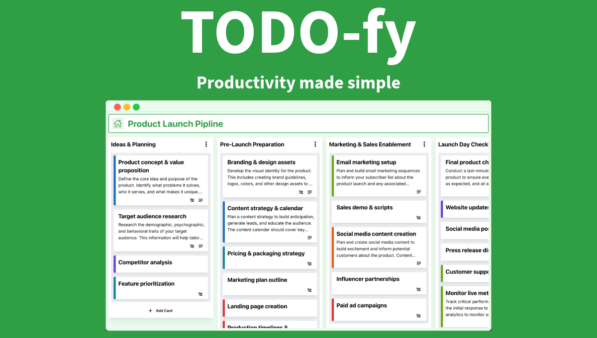

### Project Description

**[TODO-fy](https://main.d23xp5k9zvq0zh.amplifyapp.com/)** is an app that aims to help teams manage all their tasks in one place.

### Project Demo

https://github.com/user-attachments/assets/b2517f71-41c5-4903-8181-5db0ab5341a8

### How To Use TODO-fy

### Create an account

In order to start using TODO-fy, you have to first create an account.

https://github.com/user-attachments/assets/993918a4-4585-4219-afc4-133d9beef8a6

### Adding lists

Think of lists as buckets where you store tasks or cards.

https://github.com/user-attachments/assets/7dfae258-8b1f-4fa0-aa2d-fc8bf25fb14b

### Adding cards

A card represents individual tasks that need to be done.

https://github.com/user-attachments/assets/48c29efe-c9cf-436d-b0c2-09652d5c779a

### Moving lists and cards around

https://github.com/user-attachments/assets/c5d21e1d-6780-4ac9-b99a-e26e7b65ef55

### Card details

There are a couple of things you can add to a card to make it more useful to your needs.

You can add labels to cards to show things like urgency and more.

https://github.com/user-attachments/assets/441dfa7f-76eb-4df1-a9a7-bb7335035157

You can add descriptions to cards to make them more descriptive.

https://github.com/user-attachments/assets/0e70ef92-de09-4bb1-8008-bfeb5fd3c04c

Lastly, you can add subtasks to a card.

> Video Placeholder
